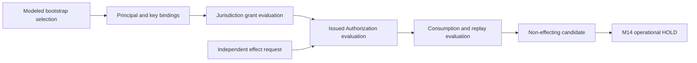

# Unit B — authority interpretation and consumption foundation

**Draft, not adopted. Pure documentary fixtures only.** Alexander approved this direction; no final exact catalog has yet been adopted. The actual root, issuer enrollment, operative grants and durable effect machinery remain unresolved.

The reference distinguishes an authority grant establishing an authorizer's jurisdiction from a separately issued Authorization exercising it. It compares both against an independently submitted request and prepares only a reference candidate. Canonical object digests cover complete representations; attestations bind those identities without becoming the identities themselves. No signature verification or real identity/control authentication is claimed.

The initial profile has four independently selected fixture roles: jurisdiction-grant issuer, authorizer, verifier and consumer. The effect actor is a separate coordinate constrained to the admitted consumer in this profile; it does not identify the target resource. A different actor requires another expressly represented profile. Required independence pairs are explicit; mere principal-name inequality cannot satisfy shared-control restrictions. Shared governing policy ancestry is distinct from shared operational administration, signing custody or evidence provenance.

All grant and Authorization restrictions are closed coordinates. Missing scope is never a wildcard. Applicable denial dominates conflict and unresolved findings. Revocation and generation observations are finite supplied fixtures, with unknown feeds distinct from explicitly complete empty feeds. Parent-grant ineffectiveness holds dependent Authorizations; no cross-generation survival, grandfathering, delegation, root replacement or automatic ambiguous-effect replay is selected.

The strongest fixture evaluation retains runtime_authority, operative_grant, effect_permitted, durable_consumption and production_ready as false. Every actual effect remains held before successful M14 fencing and fresh recheck. A diagnostic digest is neither an operative grant nor an occurrence receipt.

## Evidence boundaries

`inputs/` and the custody register capture exact documentary predecessors. Historical M09/M12 machines and the historical broad grant schema are comparison evidence, not whole-machine adoption. `custody/qualify_custody.py` checks 24 captured inputs, the accepted procedure/baseline/mapping/Unit A retention links and prospective floors, and all 132 unchanged authority cells. It does not reexecute the entire Unit A corpus or prove current remote availability.

`qualify_unit_b.py` requires an independent catalog pin, verifies selected/supporting bytes, compares exported schema constraints to the embedded reference inventory, and binds custody's actual checked buffers to the enclosing catalog. Tests and execution reports remain separately identified supporting evidence. Source review, test execution, documentary adoption and operative authority are separate claims.

The original `C:\AnarchI-Brain` repository remains read-only. No droplet, Stewardence, private keys or adjacent products are accessed. Docker verification uses bounded local first-party fixtures; it makes no claim to contain hostile specimens.

## Remaining operational prerequisites

Actual adopted bootstrap selection and root custody; enrolled principal/key identities; independently evidenced issuer/verifier control; authenticated generation and revocation publication; operative scoped grants and issued Authorizations; current authenticated request/policy; qualified M14 durable fence, recording and crash recovery; qualified projection/maintenance target and resource budget. These do not block drafting or pure fixture qualification, but hold live authority and effects closed.
